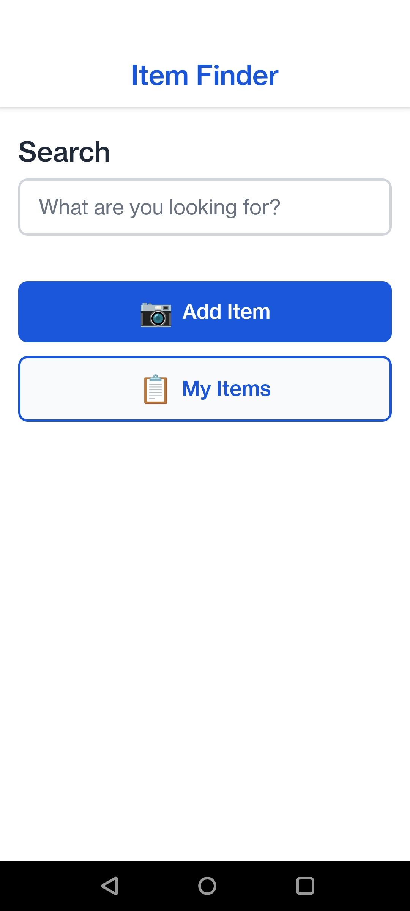
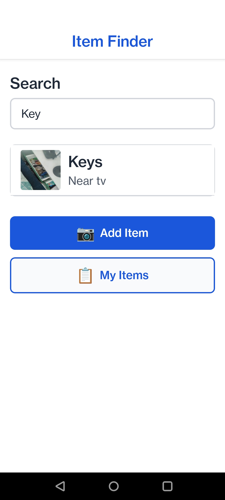

# Item Finder

> **🤖 100% of the code in this project was generated using [Amazon Kiro](https://kiro.dev)** — from requirements and design through to full implementation. No hand-written code.

A mobile app designed for elderly users to remember where they placed household items. Take a photo of an item in its location, name it, and later search by name to see the photo and recall where it was placed.

Built with simplicity in mind — large text, high contrast, minimal taps.

## Features

- **Store Items** — Photograph an item where you placed it, give it a name and optional location description. Done in 3 taps.
- **Find by Search** — Type a name (or part of one) and see a large clear photo of where the item is.
- **Fuzzy Search** — Tolerates misspellings and partial matches so you don't need to remember the exact name.
- **Browse All** — Scroll through all saved items with thumbnails, sorted alphabetically or by most recent.
- **Update Location** — Moved something? Take a new photo and the app updates instantly.
- **Accessible UI** — 18sp+ fonts, 4.5:1 contrast ratio, 48x48dp touch targets, max 2 navigation levels.

## Screenshots

| Home Screen | Search |
|:-----------:|:------:|
|  |  |

## Tech Stack

| Layer | Technology |
|-------|-----------|
| Framework | React Native (Expo SDK 53) |
| Language | TypeScript |
| Database | SQLite (expo-sqlite) |
| Image Storage | Device file system (expo-file-system) |
| Search | Fuse.js (client-side fuzzy matching) |
| State | Zustand |
| Navigation | React Navigation |
| Testing | Jest + React Native Testing Library |

**Fully offline.** No backend, no cloud, no internet required.

## Getting Started

### Prerequisites

- [Node.js](https://nodejs.org/) (v18 or later)
- [Expo CLI](https://docs.expo.dev/get-started/installation/)
- Android device or emulator (app is configured for Android)

### Installation

```bash
# Clone the repository
git clone https://github.com/YOUR_USERNAME/item-finder.git
cd item-finder

# Install dependencies
npm install

# Start the development server
npx expo start
```

### Running on a Device

```bash
# Android
npx expo start --android
```

Or scan the QR code from the Expo dev server with the [Expo Go](https://expo.dev/go) app on your phone.

### Running Tests

```bash
# Run all tests
npm test

# Watch mode
npm run test:watch

# With coverage
npm run test:coverage
```

## Project Structure

```
src/
├── components/        # Reusable UI components (LargeButton, ItemCard, etc.)
├── navigation/        # React Navigation setup
├── screens/           # App screens (Home, Camera, Search, Browse, etc.)
├── services/          # Business logic (database, photo storage, search engine)
├── store/             # Zustand state management
├── theme/             # Colors, fonts, spacing constants
├── types/             # TypeScript interfaces
└── utils/             # Utility functions
```

## How It Works

1. **Add Item** — Tap "Add Item" → camera opens → take photo → enter name → saved.
2. **Find Item** — Type in the search bar → autocomplete shows matches → tap to see the photo.
3. **Browse** — Tap "My Items" → scroll through everything you've saved.
4. **Update** — Open an item → tap "Update Location" → take new photo → done.

## Accessibility

Designed for elderly users with mild forgetfulness:

- Minimum 18sp body text, 24sp headings
- High contrast (4.5:1 ratio minimum)
- Large touch targets (48x48dp minimum)
- No icon-only buttons — all buttons have text labels
- Maximum 2 levels of navigation from the home screen
- Friendly, encouraging messages throughout
- Compatible with TalkBack (Android) and VoiceOver (iOS)

## Future Plans

- Voice input (speak item names instead of typing)
- Guided first-use walkthrough
- Local reminders to keep items up to date
- Data backup and export
- Family member access

## Building for Production

```bash
# Build Android APK
npx eas build --platform android --profile preview
```

Requires an [Expo Application Services](https://expo.dev/eas) account.

## Built With Kiro

This entire project — requirements, design, implementation, and tests — was generated using [Amazon Kiro](https://kiro.dev), an AI-powered development environment. Kiro's spec-driven workflow was used to:

1. Define structured requirements with acceptance criteria
2. Produce a technical design document
3. Generate an implementation task list
4. Write all application code from those specs

Zero lines of hand-written code.

## License

ISC
